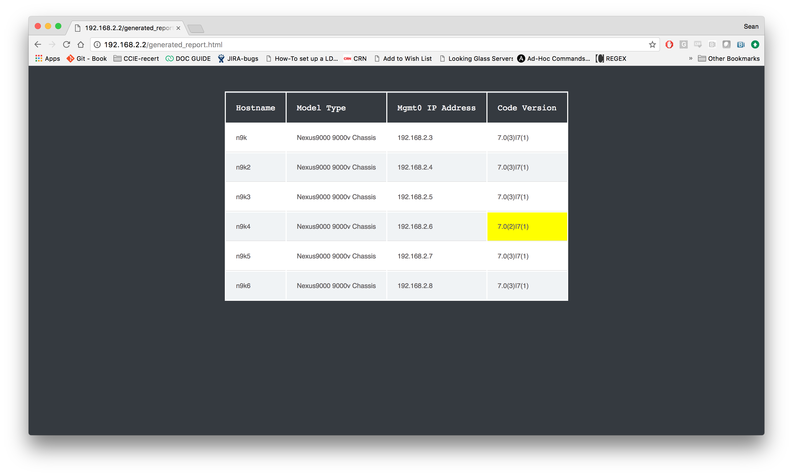

# Example of Networking Inventory with Ansible
One of the many use cases for Ansible and the [networking modules](http://docs.ansible.com/ansible/latest/list_of_network_modules.html) is to grab information in real time from the network.  In this example I will generate a HTML report using the template module from facts I have gathered with the [nxos_facts module](http://docs.ansible.com/ansible/latest/nxos_facts_module.html).


## The playbook

Only two modules are needed for this example.  The [nxos_facts module](http://docs.ansible.com/ansible/latest/nxos_facts_module.html) and the [template module](http://docs.ansible.com/ansible/latest/template_module.html)
```
---
- hosts: cisco
  connection: local
  gather_facts: False
  vars:
    desired_version: "7.0(3)I7(1)"
  tasks:
    - name: gathering nxos facts
      nxos_facts:
        provider: "{{login_info}}"

    - name: create HTML report
      template:
        src: report.j2
        dest: /var/www/html/generated_report.html
      delegate_to: localhost
      run_once: true
```

## Running the playbook

Use the `ansible-playbook` command:
```
[root@localhost ansible_inventory_report]# ansible-playbook inventory.yml

PLAY [cisco] ******************************************************************

TASK [gathering nxos facts] ***************************************************
ok: [n9k3]
ok: [n9k4]
ok: [n9k5]
ok: [n9k2]
ok: [n9k]
ok: [n9k6]

TASK [create HTML report] *****************************************************
changed: [n9k -> localhost]

PLAY RECAP ********************************************************************
n9k                        : ok=2    changed=1    unreachable=0    failed=0
n9k2                       : ok=1    changed=0    unreachable=0    failed=0
n9k3                       : ok=1    changed=0    unreachable=0    failed=0
n9k4                       : ok=1    changed=0    unreachable=0    failed=0
n9k5                       : ok=1    changed=0    unreachable=0    failed=0
n9k6                       : ok=1    changed=0    unreachable=0    failed=0
```

A very similar playbook can be used to generate a report for Cisco IOS devices using the [ios_facts module](http://docs.ansible.com/ansible/latest/ios_facts_module.html)

```
[root@localhost ansible_inventory_report]# ansible-playbook inventory-ios.yml

PLAY [build IOS XE inventory] **************************************************************

TASK [gathering IOS XE facts] **************************************************************
  ok: [172.26.249.162]
  ok: [172.26.249.161]
  ok: [172.26.249.164]
  ok: [172.26.249.163]
  ok: [172.26.249.160]
  ok: [172.26.249.151]
  ok: [172.26.249.166]
  ok: [172.26.249.153]
  ok: [172.26.249.169]
  ok: [172.26.249.152]
  ok: [172.26.249.154]
  ok: [172.26.249.159]

  TASK [create HTML report] ******************************************************************
  changed: [172.26.249.160 -> localhost]

  PLAY RECAP *********************************************************************************
  172.26.249.151             : ok=1    changed=0    unreachable=0    failed=0
  172.26.249.152             : ok=1    changed=0    unreachable=0    failed=0
  172.26.249.153             : ok=1    changed=0    unreachable=0    failed=0
  172.26.249.154             : ok=1    changed=0    unreachable=0    failed=0
  172.26.249.159             : ok=1    changed=0    unreachable=0    failed=0
  172.26.249.160             : ok=2    changed=1    unreachable=0    failed=0
  172.26.249.161             : ok=1    changed=0    unreachable=0    failed=0
  172.26.249.162             : ok=1    changed=0    unreachable=0    failed=0
  172.26.249.163             : ok=1    changed=0    unreachable=0    failed=0
  172.26.249.164             : ok=1    changed=0    unreachable=0    failed=0
  172.26.249.166             : ok=1    changed=0    unreachable=0    failed=0
  172.26.249.169             : ok=1    changed=0    unreachable=0    failed=0
  ```

---


In addition to open source Ansible, there is Red Hat® Ansible® Engine which includes support and an SLA for the nxos_facts module shown above.

Red Hat® Ansible® Engine is a fully supported product built on the simple, powerful and agentless foundation capabilities derived from the Ansible project.  Please visit [ansible.com](https://www.ansible.com/ansible-engine) for more information.
